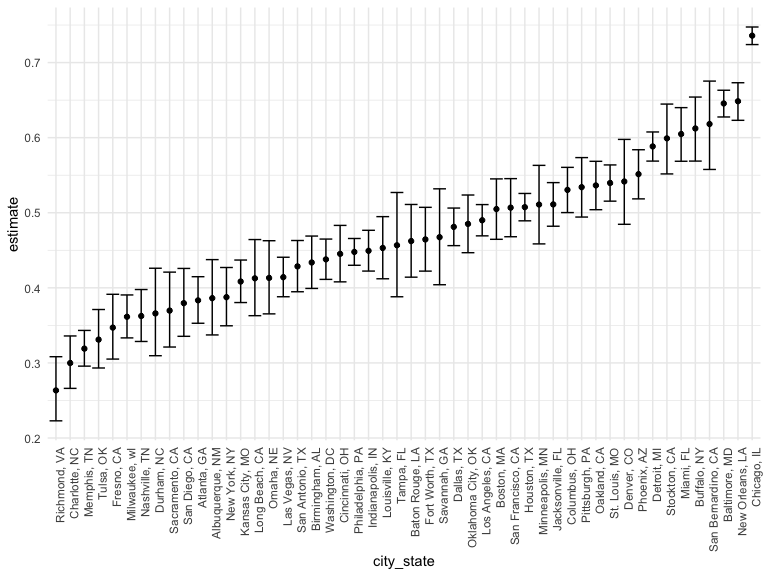

Iteration: Unsolved homicide rates
================
Weijia Xiong
10/29/2019

## Read in the data

The data come from
[here](https://github.com/washingtonpost/data-homicides).

``` r
homicide_df = 
  read_csv("data/homicide-data.csv", na = c("", "NA", "Unknown")) %>%
  mutate(
    city_state = str_c(city, state, sep = ", "),
    resolution = case_when(
      disposition == "Closed without arrest" ~ "unsolved",
      disposition == "Open/No arrest"        ~ "unsolved",
      disposition == "Closed by arrest"      ~ "solved"
    )
  ) %>% 
  filter(city_state != "Tulsa, AL") 
```

    ## Parsed with column specification:
    ## cols(
    ##   uid = col_character(),
    ##   reported_date = col_double(),
    ##   victim_last = col_character(),
    ##   victim_first = col_character(),
    ##   victim_race = col_character(),
    ##   victim_age = col_double(),
    ##   victim_sex = col_character(),
    ##   city = col_character(),
    ##   state = col_character(),
    ##   lat = col_double(),
    ##   lon = col_double(),
    ##   disposition = col_character()
    ## )

## Aggregate at the city level

``` r
city_homicide_df =
  homicide_df %>% 
  select(city_state, resolution, disposition) %>% 
  group_by(city_state) %>% 
  summarize(
    hom_unsolved = sum(resolution == "unsolved"),
    hom_total = n()
  )
```

## For one city …

… get the estimated rate of unsolved homicides and CI using
`prop.test()` and `broom::tidy()`

``` r
prop.test(
  x = city_homicide_df %>% filter(city_state == "Tulsa, OK") %>% pull(hom_unsolved), 
  n = city_homicide_df %>% filter(city_state == "Tulsa, OK") %>% pull(hom_total)) %>% 
  broom::tidy()
```

    ## # A tibble: 1 x 8
    ##   estimate statistic  p.value parameter conf.low conf.high method
    ##      <dbl>     <dbl>    <dbl>     <int>    <dbl>     <dbl> <chr> 
    ## 1    0.331      65.9 4.76e-16         1    0.293     0.371 1-sam…
    ## # … with 1 more variable: alternative <chr>

## Repeat for all cities

``` r
homicide_results = 
  city_homicide_df %>% 
  mutate(
    prop_test = map2(.x = hom_unsolved, .y = hom_total, ~prop.test(x = .x, n = .y)),
    estimate_df = map(prop_test, broom::tidy)) %>% 
  select(city_state, estimate_df) %>% 
  unnest(estimate_df) %>% 
  select(city_state, estimate, conf.low, conf.high) %>% 
  mutate(city_state = fct_reorder(city_state, estimate))
```

## Visualize results

``` r
homicide_results %>% 
  ggplot(aes(x = city_state, y = estimate)) + 
  geom_point() + 
  geom_errorbar(aes(ymin = conf.low, ymax = conf.high)) +  
  theme(axis.text.x = element_text(angle = 90, hjust = 1))
```


