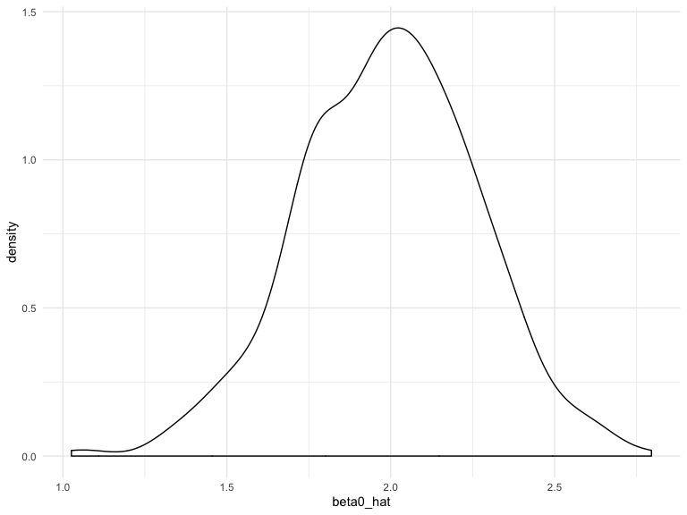
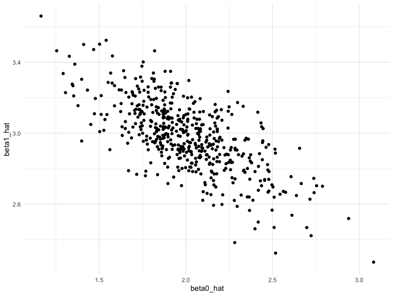
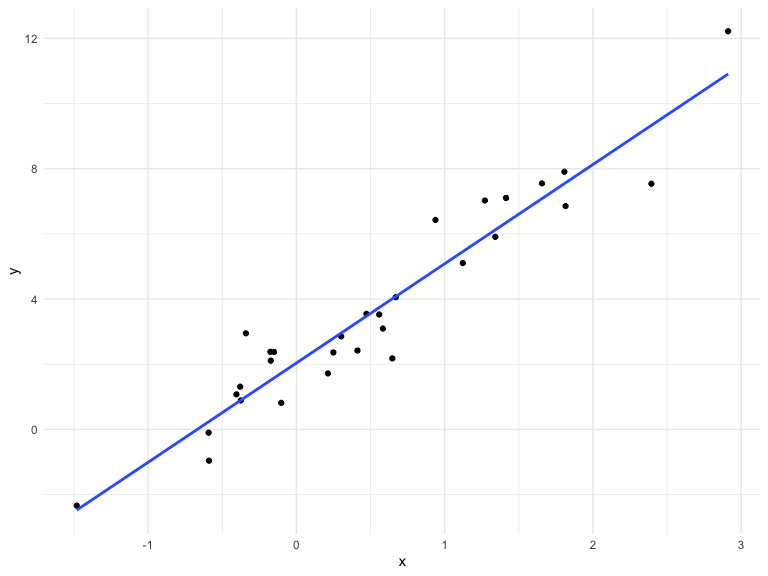
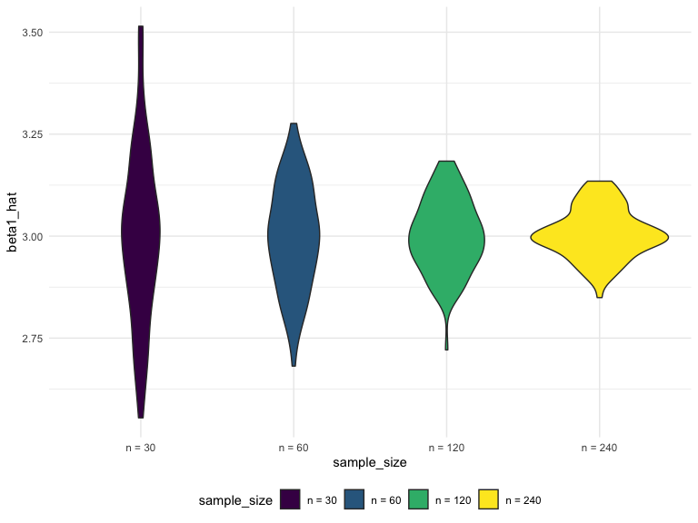
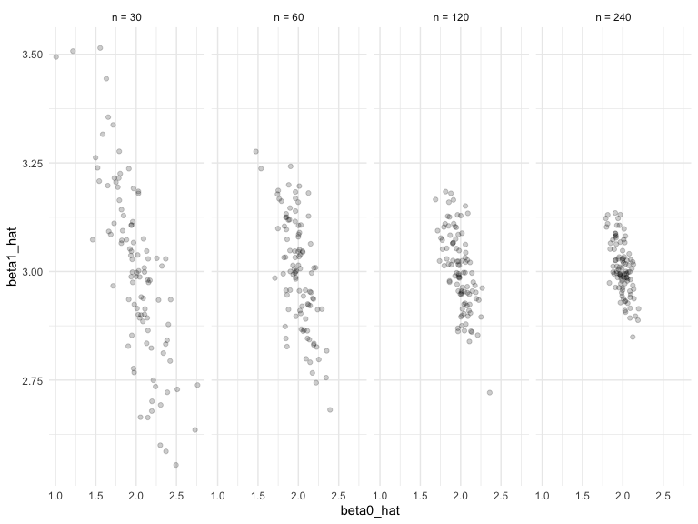

Simulation
================
Weijia Xiong
10/31/2019

## Time to simulate :-)

``` r
sim_regression = function(n, beta0 = 2, beta1 = 3) {
  
  sim_data = tibble(
    x = rnorm(n, mean = 1, sd = 1),
    y = beta0 + beta1 * x + rnorm(n, 0, 1)
  )
  
  ls_fit = lm(y ~ x, data = sim_data)
  
  tibble(
    beta0_hat = coef(ls_fit)[1],
    beta1_hat = coef(ls_fit)[2]
  )
}
```

``` r
output = vector("list", 1500)

for (i in 1:500) {
  output[[i]] = sim_regression(30)
}

sim_results = bind_rows(output) #bindrows for list?

bind_rows(output) %>% 
  ggplot(aes(x = beta0_hat)) +
  geom_density()
```



## rerun instead loop

``` r
sim_results = 
  rerun(500, sim_regression(30, 2, 3)) %>%  ## rerun
  bind_rows()

sim_results %>% 
  ggplot(aes(x = beta0_hat, y = beta1_hat)) + 
  geom_point()
```



``` r
sim_data = tibble(
  x = rnorm(30,1,1),
  y = 2 + 3 * x + rnorm(30,0,1)
)

sim_data %>% 
  ggplot(aes(x = x, y = y)) +
  geom_point() +
  stat_smooth(method = "lm",se = FALSE)
```



``` r
#mean and var
sim_results %>% 
  gather(key = parameter, value = estimate, beta0_hat:beta1_hat) %>% 
  group_by(parameter) %>% 
  summarize(emp_mean = mean(estimate), 
            emp_var = var(estimate)) %>% 
  knitr::kable(digits = 3)
```

| parameter  | emp\_mean | emp\_var |
| :--------- | --------: | -------: |
| beta0\_hat |     2.006 |    0.082 |
| beta1\_hat |     2.984 |    0.039 |

``` r
#use pivot
sim_results %>% 
  pivot_longer(
    beta0_hat:beta1_hat,
    names_to = "parameter",
    values_to = "estimate"
  ) %>% 
  group_by(parameter) %>% 
  summarize(emp_mean = mean(estimate), 
            emp_var = var(estimate)) %>% 
  knitr::kable(digits = 3)
```

| parameter  | emp\_mean | emp\_var |
| :--------- | --------: | -------: |
| beta0\_hat |     2.006 |    0.082 |
| beta1\_hat |     2.984 |    0.039 |

## try another

``` r
n_list = list(
  "n_30" = 30,
  "n_60" = 60,
  "n_120" = 120,
  "n_240" = 240
 )

output = vector("list",length = 4)

for (i in 1:4) {
  output[[i]] = rerun(100, sim_regression(n_list[[i]])) %>% 
    bind_rows
}

output
```

    ## [[1]]
    ## # A tibble: 100 x 2
    ##    beta0_hat beta1_hat
    ##        <dbl>     <dbl>
    ##  1      1.64      3.15
    ##  2      2.01      3.03
    ##  3      2.00      2.92
    ##  4      2.43      2.50
    ##  5      1.92      3.02
    ##  6      2.26      2.82
    ##  7      2.18      2.86
    ##  8      2.14      2.95
    ##  9      2.05      3.07
    ## 10      2.04      2.71
    ## # … with 90 more rows
    ## 
    ## [[2]]
    ## # A tibble: 100 x 2
    ##    beta0_hat beta1_hat
    ##        <dbl>     <dbl>
    ##  1      2.37      2.86
    ##  2      2.10      2.77
    ##  3      1.79      2.98
    ##  4      2.20      2.98
    ##  5      1.94      3.07
    ##  6      1.81      3.11
    ##  7      2.00      3.00
    ##  8      2.34      2.71
    ##  9      2.09      2.85
    ## 10      1.79      3.24
    ## # … with 90 more rows
    ## 
    ## [[3]]
    ## # A tibble: 100 x 2
    ##    beta0_hat beta1_hat
    ##        <dbl>     <dbl>
    ##  1      1.79      3.08
    ##  2      1.80      3.15
    ##  3      1.85      3.11
    ##  4      2.00      2.96
    ##  5      1.90      3.11
    ##  6      1.93      2.99
    ##  7      2.23      2.88
    ##  8      2.11      2.99
    ##  9      1.95      2.96
    ## 10      1.90      3.03
    ## # … with 90 more rows
    ## 
    ## [[4]]
    ## # A tibble: 100 x 2
    ##    beta0_hat beta1_hat
    ##        <dbl>     <dbl>
    ##  1      2.06      2.97
    ##  2      2.02      3.03
    ##  3      1.95      3.11
    ##  4      1.87      3.03
    ##  5      1.94      2.98
    ##  6      1.98      2.98
    ##  7      2.09      3.00
    ##  8      1.95      3.02
    ##  9      2.03      3.07
    ## 10      1.95      3.03
    ## # … with 90 more rows

``` r
sim_results = 
  tibble(n = c(30, 60, 120, 240)) %>% 
  mutate(
    output_list = map(.x = n, ~rerun(10,sim_regression(n = .x)))
  ) %>% 
  unnest

sim_results
```

    ## # A tibble: 40 x 2
    ##        n output_list     
    ##    <dbl> <list>          
    ##  1    30 <tibble [1 × 2]>
    ##  2    30 <tibble [1 × 2]>
    ##  3    30 <tibble [1 × 2]>
    ##  4    30 <tibble [1 × 2]>
    ##  5    30 <tibble [1 × 2]>
    ##  6    30 <tibble [1 × 2]>
    ##  7    30 <tibble [1 × 2]>
    ##  8    30 <tibble [1 × 2]>
    ##  9    30 <tibble [1 × 2]>
    ## 10    30 <tibble [1 × 2]>
    ## # … with 30 more rows

``` r
simulate_n_regressions = function(n_runs = 100, n, beta0 = 2, beta1 = 3) {
  
  rerun(n_runs, sim_regression(n, beta0, beta1)) %>% 
    bind_rows()
  
}

sim_results = 
  tibble(sample_size = c(30, 60, 120, 240)) %>% 
  mutate(estimate_dfs = map(.x = sample_size, ~simulate_n_regressions(n = .x))) %>% 
  unnest
```

``` r
sim_results = 
  tibble(sample_size = c(30, 60, 120, 240)) %>% 
  mutate(
    output_list  = map(.x = sample_size, ~rerun(100,sim_regression(n = .x))),
    output_df = map(output_list,bind_rows)) %>% 
  select(-output_list) %>% 
  unnest
```

``` r
sim_results %>% 
  group_by(sample_size) %>% 
  summarize(
    var_b1 = var(beta1_hat)
  )
```

    ## # A tibble: 4 x 2
    ##   sample_size  var_b1
    ##         <dbl>   <dbl>
    ## 1          30 0.0421 
    ## 2          60 0.0161 
    ## 3         120 0.00800
    ## 4         240 0.00370

``` r
sim_results %>% 
  mutate(
    sample_size = str_c("n = ", sample_size),
    sample_size = fct_inorder(sample_size)) %>% 
  ggplot(aes(x = sample_size, y = beta1_hat, fill = sample_size)) + 
  geom_violin()
```



``` r
sim_results %>% 
  mutate(
    sample_size = str_c("n = ", sample_size),
    sample_size = fct_inorder(sample_size)) %>% 
  ggplot(aes(x = beta0_hat, y = beta1_hat)) + 
  geom_point(alpha = .2) + 
  facet_grid(~sample_size)
```


