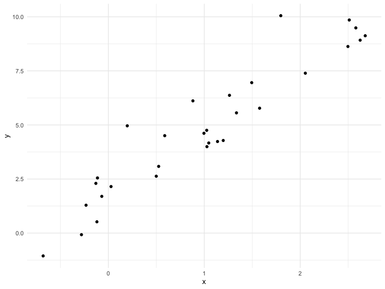

writing functions
================
Weijia Xiong
10/24/2019

## Get started

We are going to write some functions.

``` r
set.seed(1)
x = rnorm(30, mean = 4, sd = 2.3)
x_again = rnorm(30, mean = 6, sd = 0.3)
y = rnorm(30, mean = 4, sd = 0.3)
(x - mean(x)) / sd(x)
```

    ##  [1] -0.767120446  0.109493425 -0.993470503  1.637039863  0.267334741
    ##  [6] -0.977065475  0.438222871  0.709719461  0.533829741 -0.419692475
    ## [11]  1.546684110  0.332624325 -0.761479160 -2.485776741  1.128069748
    ## [16] -0.137851865 -0.106748415  0.932105430  0.799422547  0.553437533
    ## [21]  0.905205442  0.757128408 -0.008541293 -2.241925304  0.581490604
    ## [26] -0.149966223 -0.257816586 -1.680744021 -0.606639531  0.363029790

``` r
(x_again - mean(x_again)) / sd(x_again)
```

    ##  [1]  1.5413954 -0.2961850  0.3204956 -0.2345965 -1.8983946 -0.6887392
    ##  [7] -0.6627062 -0.2415224  1.2161757  0.7926368 -0.3738088 -0.4855096
    ## [13]  0.7093845  0.5329776 -1.0329536 -1.0565157  0.2914637  0.7993727
    ## [19] -0.3082034  0.9409190  0.3336151 -0.9364778  0.2619634 -1.5869527
    ## [25]  1.6348722  2.3231173 -0.6286716 -1.4797904  0.5493942 -0.3367558

Now a function:

``` r
z_scores = function(x) {
  
  z = (x - mean(x)) / sd(x)
  z
  
}

z_scores(x_again)
```

    ##  [1]  1.5413954 -0.2961850  0.3204956 -0.2345965 -1.8983946 -0.6887392
    ##  [7] -0.6627062 -0.2415224  1.2161757  0.7926368 -0.3738088 -0.4855096
    ## [13]  0.7093845  0.5329776 -1.0329536 -1.0565157  0.2914637  0.7993727
    ## [19] -0.3082034  0.9409190  0.3336151 -0.9364778  0.2619634 -1.5869527
    ## [25]  1.6348722  2.3231173 -0.6286716 -1.4797904  0.5493942 -0.3367558

``` r
z_scores(x = y)
```

    ##  [1]  2.38595050 -0.15569173  0.60338763 -0.08567310 -0.88879488
    ##  [6]  0.08175617 -1.99431792  1.41123701  0.04474978  2.14748861
    ## [11]  0.38031212 -0.85409202  0.52111213 -1.08749856 -1.42022815
    ## [16]  0.18864874 -0.57642714 -0.11368049 -0.03742056 -0.72869410
    ## [21] -0.70698088 -0.25559170  1.11189943 -1.70130726  0.50363910
    ## [26]  0.23186661  0.99216438 -0.43157534  0.27046563  0.16329598

``` r
z_scores(3)
```

    ## [1] NA

``` r
z_scores("my name is jeff")
```

    ## Error in x - mean(x): non-numeric argument to binary operator

``` r
z_scores(iris)
```

    ## Error in is.data.frame(x): (list) object cannot be coerced to type 'double'

``` r
z_scores(sample(c(TRUE, FALSE), 25, replace = TRUE))
```

    ##  [1] -1.0198039  0.9413574  0.9413574  0.9413574  0.9413574  0.9413574
    ##  [7] -1.0198039  0.9413574 -1.0198039  0.9413574  0.9413574 -1.0198039
    ## [13]  0.9413574 -1.0198039 -1.0198039 -1.0198039  0.9413574 -1.0198039
    ## [19]  0.9413574  0.9413574 -1.0198039 -1.0198039  0.9413574 -1.0198039
    ## [25] -1.0198039

``` r
z_scores(c(TRUE,TRUE,FALSE,TRUE))  #= z_scores(c(1,1,0,1))
```

    ## [1]  0.5  0.5 -1.5  0.5

``` r
z_scores = function(x) {
  
  if (!is.numeric(x)) {
    stop("Argument x should be numeric")
  } else if (length(x) == 1) {
    stop("x should be longer than 3")
  }
  
  z = mean(x) / sd(x)
  
  z
}

z_scores(3)
```

    ## Error in z_scores(3): x should be longer than 3

``` r
z_scores(iris)
```

    ## Error in z_scores(iris): Argument x should be numeric

## Multiple outpus

return to list

``` r
mean_and_sd = function(input_x) {
  
  if (!is.numeric(input_x)) {
    stop("Argument input_x should be numeric")
  } else if (length(input_x) < 3 ) {
    stop("input_x should be longer than 3")
  }
  
  mean_input = mean(input_x)
  sd_input = sd(input_x)

  list(mean = mean_input, 
       sd = sd_input,
       z_score = (input_x - mean(input_x)) / sd(input_x)
  )
}


mean_and_sd(y)
```

    ## $mean
    ## [1] 4.033083
    ## 
    ## $sd
    ## [1] 0.288104
    ## 
    ## $z_score
    ##  [1]  2.38595050 -0.15569173  0.60338763 -0.08567310 -0.88879488
    ##  [6]  0.08175617 -1.99431792  1.41123701  0.04474978  2.14748861
    ## [11]  0.38031212 -0.85409202  0.52111213 -1.08749856 -1.42022815
    ## [16]  0.18864874 -0.57642714 -0.11368049 -0.03742056 -0.72869410
    ## [21] -0.70698088 -0.25559170  1.11189943 -1.70130726  0.50363910
    ## [26]  0.23186661  0.99216438 -0.43157534  0.27046563  0.16329598

return to dataframe

``` r
mean_and_sd = function(input_x) {
  
  if (!is.numeric(input_x)) {
    stop("Argument input_x should be numeric")
  } else if (length(input_x) == 1) {
    stop("Cannot be computed for length 1 vectors")
  }
  
  mean_input = mean(input_x)
  sd_input = sd(input_x)

  tibble(
    mean = mean_input, 
    sd = sd_input
  )
}

mean_and_sd(input_x = y)
```

    ## # A tibble: 1 x 2
    ##    mean    sd
    ##   <dbl> <dbl>
    ## 1  4.03 0.288

``` r
sim_data  = tibble(
  x = rnorm(30, mean = 1, sd = 1),
  y = 2 + 3 * x + rnorm(30, 0, 1)
)

sim_data %>% 
  ggplot(aes(x = x, y = y)) +
  geom_point()
```



``` r
ls_fit = lm(y ~ x, data = sim_data)

beta0_hat = coef(ls_fit)[1]
beta_hat = coef(ls_fit)[2]
```

``` r
sim_regression = function(n, beta0 = 2, beta1 =3){
  
  sim_data  = tibble(
  x = rnorm(n, mean = 1, sd = 1),
  y = beta0 + beta1 * x + rnorm(n, 0, 1)
)
  ls_fit = lm(y ~ x, data = sim_data)

  tibble(
  beta0_hat = coef(ls_fit)[1],
  beta_hat = coef(ls_fit)[2]
  )
}

sim_regression(n = 3000 ,beta0 = 17, beta1 = -3)
```

    ## # A tibble: 1 x 2
    ##   beta0_hat beta_hat
    ##       <dbl>    <dbl>
    ## 1      17.0    -3.03

``` r
sim_regression(n = 3000, beta0 = 17)  #use default.
```

    ## # A tibble: 1 x 2
    ##   beta0_hat beta_hat
    ##       <dbl>    <dbl>
    ## 1      17.0     3.01
